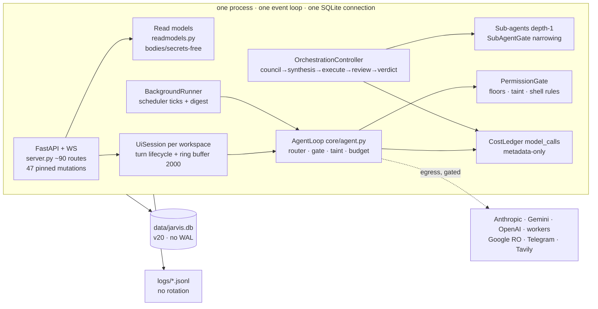
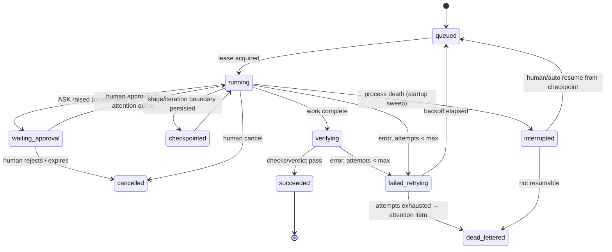

# Kairo 10× Product & Platform Improvement Plan

| | |
|---|---|
| **Audit date** | 2026-07-12 |
| **Commit reviewed** | `98c4ebc` — "Core: add safe orchestration follow-ups" (2026-07-12) |
| **Working tree** | Dirty: 20 tracked files modified (+646/−110); untracked: `docs/fable-frontend-parity/`, `docs/PLAN-7-voice-consent-checkpoint.md`, `src/jarvis/ui/static/ui/task-draft.js`, `tests/unit/test_ui_route_consumption.py`, `mcp_sample.json`. All working-tree changes are labeled **WIP** throughout this plan. |
| **Scope** | Full read-only audit: source (`src/jarvis`, ~150 modules), config, tests (236 test files), docs/ADRs, working-tree diff, and the fresh frontend↔backend parity audit (`docs/fable-frontend-parity/`, revalidated against the current tree). Targeted keyless unit tests were run read-only (39 passed, 1 Windows-privilege skip, 2m17s). |
| **Limitations** | No live model calls were made and no live browser session was driven; UI behavior is verified from source, tests, and the existing DoD harnesses. No production metrics exist to cite — where a number would be needed, this plan specifies the telemetry to create it rather than inventing it. `.env` values and secrets were never read. |

---

## Status update — 2026-07-12

This plan is a historical planning baseline, written against `98c4ebc` and its WIP. Current HEAD
`e78cfcd` is fourteen commits later. The original analysis and longer-horizon recommendations remain
useful; the WIP/backlog wording below is not a live implementation status.

### Completed from the baseline

- The parity WIP landed: workspace capability/scoping fixes, per-turn cancellation, attended
  task/memory/project controls, task history, notices, connector-write audit, sub-agent progress,
  federated search, and the route-consumption contract (`a02ff29` through `fe5c8f2`).
- The reliability floor items for SQLite contention and log rotation/redaction landed (`04889af`,
  `0727484`); orchestration actual cost now fails closed if its ledger loses a row (`aca6c83`).
- Project-grounded Vault evidence, dead UI cleanup, and Vault CSP compliance are complete
  (`6105969`, `2bf532f`, `e78cfcd`).

### Current priorities that still require work or an owner decision

1. Decide the unstaged `web_search: allow` authority change before committing it; HEAD remains
   `ask`, and any approved posture needs visible Settings/docs copy.
2. Decide read-scope confinement, retention, parking semantics, NotificationRouter wiring, the
   skills pilot, and saved-view/budget product direction before implementation broadens authority.
3. Continue the durability roadmap: retry/backoff, park-for-approval, resume/checkpoints,
   outcome labels, estimator calibration, and measured caching experiments.

For the current frontend/backend parity state and the remaining UI-specific work, see the dated
addendum in [the parity audit executive summary](fable-frontend-parity/00-executive-summary.md).

---

## 1. Executive Decision Brief

### Current maturity assessment

Kairo is three products at three maturity levels sharing one codebase:

1. **A safety-first assistant core — mature.** The permission gate with hard floors, egress-taint demotion, nonce+liveness approvals, per-launch token auth with strict CSP, quarantined ingestion, sub-agent narrowing, a $0 keyless eval replay gate, and a metadata-only cost ledger are genuinely implemented, tested, and internally consistent (evidence throughout §3, §9). This spine is better than most commercial agent products and must be preserved unchanged.
2. **A work platform — mid-maturity, and actively improving in the current WIP.** The task→run→review→evidence loop exists end-to-end in the backend, and the working tree is right now landing its missing UI last-mile (attended task creation, per-turn Stop, task run history, a route-consumption contract test). But delegation still goes dark in the chat thread, federated search is unreachable, and the evidence layer (notices, agent runs, connector writes) is persisted-but-invisible.
3. **An autonomous platform — early.** Every background mechanism exists (scheduler, orchestration, write-intent queue, attention center, caged dreaming), but nothing survives a crash except as an `aborted` row, nothing retries with backoff, no run can park for approval and resume, success is never labeled, and actual cost is never reconciled against estimates. Autonomy today is safe because it is *brittle-by-design*: work stops rather than misbehaves. That is the right v1 posture and the wrong end state.

Underneath all three: **operational hygiene has not kept up with an always-on ambition.** Logs grow ~52 MB/day with no rotation and contain raw tool inputs (`observability/logging.py:80-87`; observed `logs/jarvis-2026-07-11.jsonl` = 51.8 MB); SQLite runs without WAL or busy_timeout on one shared connection (`persistence/db.py:42-45`); `read_file` is auto-allowed anywhere on disk outside the secret floor (`tools/filesystem.py:77-82`, `permissions/gate.py:208-216`); and there is no latency percentile or error-rate aggregation anywhere in `src/` (grep: zero matches for percentile/quantile).

### The 10× vision in plain language

Today, the honest user contract is: *"Kairo does what I watch it do, safely."* The target contract is:

> "I hand Kairo a meaningful job with a visible plan, budget, and permission scope. I walk away. It works, checkpoints, and if it needs me it parks and files one clear item in my inbox — it never guesses and never silently stops. When I return, I see what it verified, what it produced, what it decided, and what it spent — and a one-click next action. If the machine restarted in between, the job picked up where it left off."

Every gap between those two sentences is enumerated in this plan, and almost all of it is *extension of existing machinery*, not new architecture: the run tables, the attention queue, the write-intent state machine, the estimate engine, and the ledger already exist. What is missing is durability (resume, retry, parking), accounting (outcome labels, reconciliation), and the last mile of UI.

### Top five highest-leverage changes

1. **The reliability floor (days, not weeks): WAL + busy_timeout, log rotation + redaction, and a decision on read-scope confinement.** Three small changes (`db.py:42-45`, `logging.py:80-87`, `gate.py:208-216`) that everything else — especially unattended work — silently depends on. (§9 Critical, tickets B-02/B-03/B-04)
2. **Close the outcome-accounting loop.** Label every turn/run outcome, write `actual_cost_usd` back to orchestration runs (today `engine._finish` never passes it, so net ROI is permanently None — `orchestration/engine.py:553-561`, `ui/readmodels.py:538`), and add per-tool attribution. This single change makes "cost per verified successful task" computable at all. (§8, tickets B-05/B-06)
3. **Durable autonomy contracts: retry-with-backoff, park-for-approval, and resume.** Convert the current abort-everything crash story (`scheduler/service.py:248-287`, `orchestration/store.py:203-221`) into: jobs retry with backoff and dead-letter into the attention queue; unattended runs hitting an ASK park as `needs_approval` instead of deny-and-continue; orchestration checkpoints stage results and resumes. No new authority is granted anywhere — approvals still flow through the existing human queues. (§6)
4. **Finish the evidence/visibility last mile.** Land the in-flight WIP (it is green — verified this session), then: sub-agent progress in the thread (`conversation.js:237-253` drops delivered events), palette on federated `/api/search` (built, unreachable — `server.py:1960`, `palette.js:212`), notices feed + `connector_writes` read model. The backend has already paid for all of it. (§4, §5)
5. **Turn on measured cost efficiency.** Prompt caching is fully implemented and **off by default** (`config.py:487`, `models/context_reuse.py`, `core/anthropic_client.py:161-187`). Enable it behind an eval-verified experiment, calibrate the worst-case estimator against recorded actuals, and use the existing `routing_mode` ledger column to prove the Auto router's value. (§8)

### Biggest risks of doing nothing

- **Disk/DB failure on the always-on box.** ~52 MB/day of unrotated plaintext logs plus a rollback-journal SQLite with no busy_timeout is a slow-motion outage with data-loss characteristics — and the logs retain every tool input forever (privacy exposure on the user's own machine).
- **Trust erosion exactly where the product is headed.** Leaving agents running is the roadmap (Phase 16 scheduling is deliberately parked at Checkpoint K); today a crash mid-job aborts silently into a table no UI shows, and a cancelled chat turn discards all its work (`ui/session.py:250-255`). Users learn to babysit, which caps the product at "chat."
- **Unmeasurable economics.** Without outcome labels and reconciliation, model-routing and caching decisions stay vibe-based; the eval infrastructure that could arbitrate them ($0 replay gate) can't see production behavior.
- **Silent posture drift.** The working tree flips `web_search` from ask→allow with no UI surfacing of non-default policy and README still teaching ask-first (`config/permissions.yaml` WIP diff; `README.md` education); the auto-persist path also strips every explanatory comment from `permissions.yaml`. Policy and its documentation are already diverging.

### Recommended 30/90/180-day direction

- **0–30 days — "Stop losing things."** Land the WIP; reliability floor (WAL, rotation, read-scope decision); outcome labels + cost write-back; percentile read model; cancel-preserves-work; Settings shows non-default permission policy. Exit: nothing is silently lost — no log growth unbounded, no turn work discarded, no unlabeled run, no invisible policy.
- **31–90 days — "Leave it running."** Retry/backoff + attention-queue dead-lettering; parked `needs_approval` runs; orchestration stage checkpoints + resume; sub-agent thread visibility; federated palette search; notices/connector-writes evidence surfaces; caching experiment + estimate calibration; Windows CI leg + mypy on the safety core. Exit: a machine restart or an ASK mid-run costs nothing but wall-clock time, and the UI can prove it.
- **91–180 days — "Scale the skills, grow autonomy narrowly."** Activate the skill-pack pilot (catalog is built and fail-closed, `mode: off` today — `config/settings.yaml` WIP, `src/jarvis/skills/`); skill observability via the v19 manifest join; schedule dreaming and morning-briefing jobs behind Checkpoint K with the parking mechanics from phase 2; NotificationRouter behind its own checkpoint. Exit: two curated skill packs measurably improving eval outcomes; one genuinely unattended daily job with exception-only notifications.

---

## 2. Evidence, Scope, and Assumptions

**Source precedence (highest wins):**
1. Code in the working tree (including WIP, labeled).
2. Tests (what is pinned is what is true; e.g., the mutation-route closed set is **47** POST routes at `tests/unit/test_ui_readmodels.py:136-209` — README/ADR-0022 still say 43 and are stale).
3. Config (`config/*.yaml`) — noting that `permissions.yaml` is machine-rewritten on "always allow" and loses comments.
4. Docs/ADRs — used for intent, never for behavior claims. `docs/architecture.md` is titled "as built — Phase 8" and is ~8 phases stale (`architecture.md:1`); ADRs 0001–0023 track phases closely and are current.

**Confidence levels used in this plan:**
- **VERIFIED** — I read the code/diff or ran the test in this session.
- **HIGH** — reported by a scoped audit pass with `path:line` citations; spot-checked where load-bearing.
- **MEDIUM / INFERENCE** — explicitly labeled inline. Anything not verifiable is labeled UNKNOWN rather than asserted.

**Assumptions:** single-user, single-machine (Windows 11) deployment; company-paid API keys (cost control is about *efficiency and visibility*, not austerity — quality-affecting downgrades are out of scope per the product's own routing rules); the parity audit in `docs/fable-frontend-parity/` was written this session against this HEAD and re-checked against the WIP diff — where the WIP supersedes a finding, this plan says so explicitly rather than repeating the stale claim.

**What the WIP changes (VERIFIED from `git diff`):** capability_truth workspace pass-through for `/api/hub` + `/api/settings` (fixes the read model's self-contradiction); `/api/chat/knowledge` accepts an explicit `project_id` with match-or-404; `/api/workspace/{id}` + `/activity` now workspace-locked; `/api/tasks/{id}/runs` workspace-scoped; per-turn **Stop** button wired to `POST /api/turn/cancel` with non-optimistic settle; attended task-draft dialog (follow-up→task promotion, history viewer) in new `ui/task-draft.js`; vault readiness cards; GraphRAG one-hop dependency excerpts with fail-closed re-checks and untrusted framing; a new route-consumption manifest test with 16 explicit exemptions; `skills:` config block (`mode: off`); `web_search: ask → allow`; `config/skills` added to the write denylist. The touched test files pass (39/1 skip, VERIFIED).

---

## 3. Current-State Map

### 3.1 Architecture as actually built

One Python 3.12 process runs everything. `jarvis --ui` (`cli/repl.py:1591,1622-1737`) opens **one** `aiosqlite` connection to `data/jarvis.db`, runs migrations v1→v20 with a fail-closed pre-migration snapshot (`persistence/db.py:36-45`, `persistence/migrations.py:1078-1099`), and composes: the FastAPI/WebSocket server, per-workspace `AgentLoop`s + `UiSession`s, the `BackgroundRunner` (scheduler + digest), the `OrchestrationController`, memory/knowledge/graph services, connectors, voice, and the cost ledger — all on one asyncio event loop, serialized by one shared write lock and one shared `turn_lock` (one-writer rule).

**Authority boundaries (preserve exactly as-is):** PermissionGate with code-enforced sensitive-path floors YAML cannot loosen (`permissions/gate.py:1-27,182,214`; `paths.py:96-107`); egress-taint — a private read demotes any egress ALLOW to a non-persistable human ASK that Auto mode cannot self-approve (`core/agent.py:624-722`, VERIFIED range); SubAgentGate narrowing-only with `NEVER_GRANTABLE={run_shell,write_file}` and hard-denied `{spawn_agent,schedule_task,cancel_task,remember,forget}` (`permissions/subagent.py:51-57,110-201`); unattended jobs deny every ASK via `HeadlessApprover` and demote egress ALLOW→DENY (`cli/jobs.py:91-101`); planner/judge/utility pinned to Anthropic at every override layer (`models/registry.py:63-71`, `models/providers.py:184-186`); write-intents two-phase `draft→previewed→approved→executed→undone` with idempotency keys (`actions/intents.py:39-78,317-327`); dreaming caged to a five-tool read-only allowlist with construction-time verification and a fail-closed budget (`attention/dreaming.py:32-135`).

### 3.2 Agent lifecycle as-built (all HIGH confidence, line-cited)

| Work type | Durable record | Crash recovery | Retry | Cancel | Dollar cap |
|---|---|---|---|---|---|
| Interactive turn | Transcript persisted **only after** the turn completes (`ui/session.py:250-255`) | **None** — in-flight turn work is lost; no sweep covers it | n/a | Yes (WIP UI) — but cancel **discards** all in-turn blocks | $0.75/turn, **UI loop only** (`config.py:150`; `repl.py:1342-1343`) |
| Scheduled job/digest | `task_runs` row opened before work | Startup sweep → `aborted`, advanced past occurrence, **never resumed** (`scheduler/service.py:248-287`) | None — next scheduled fire only; 3 consecutive failures → terminal `failed`, no backoff, no DLQ (`service.py:312-333`) | Runner pause only (global) | None per-job |
| Orchestration run | `orchestration_runs` + stage column | Sweep → `aborted`; stage recorded, **stage results not checkpointed** (`orchestration/store.py:203-221`) | None per stage; revise loop ≤3 rounds is verdict-driven | Yes (`ui/orchestration.py:285-295`) — route currently exempted as "awaits a scoped Studio control" (WIP manifest) | Estimate-gated pre-run; hard stop checked **only between rounds** (`engine.py:698-702`) |
| Sub-agent | `agent_runs` row | Sweep → `aborted` | None | With parent | Iterations/time/parallel caps only — **no per-child $ cap** (`config.py:216-222`) |
| Dreaming | attention proposal rows | n/a (single tool-less call) | n/a | n/a | $1.5 fail-closed; 0 disables (`attention/dreaming.py:115-135`) |

The unifying pattern: **durability = detect-and-abort.** Every mechanism correctly refuses to double-run side effects, and none can continue. There is also no `needs_approval`/`blocked` state anywhere — background work that needs a human either fails (jobs) or terminates (orchestration `budget_stopped`), leaving a durable attention/intent row behind.

### 3.3 User journeys (status at this HEAD + WIP)

| Journey | Status | Evidence |
|---|---|---|
| Ask → act → approve → result | **Works, well-tested** | parity audit W1; nonce/liveness `ui/approver.py:101-196` |
| Stop the current turn | **WIP — landing now** | `chat.js` diff wires `#chat-turn-cancel` → `/api/turn/cancel` (VERIFIED) |
| Create/schedule a task from the UI | **WIP — landing now** | `ui/task-draft.js` (attended, human-edited, never auto-schedules; VERIFIED) |
| See what a task run did | **WIP** (history dialog) + gaps: notices, agent runs, connector writes still invisible | exemption manifest entries (VERIFIED) |
| Watch a delegated sub-agent work | **Broken** — events delivered and dropped by the thread renderer | `conversation.js:237-253` (unchanged in WIP) |
| Find anything (chats by content, tasks, digests) | **Broken** — 8-domain `/api/search` built, palette queries graph-only | `server.py:1960`; `palette.js:212` |
| Leave a job running unattended | **Fragile** — works until any failure/restart; then terminal, invisible | §3.2 |
| Review knowledge / retrieval grounding | **Works**, improved in WIP (readiness cards, dependency excerpts) | diff, VERIFIED |
| Know what Kairo can do right now | **Fixed in WIP** (capability_truth pass-through) | `server.py` diff, VERIFIED |

### 3.4 Existing strengths to preserve (do not "improve" these)

The safety spine (§3.1); the estimate→confirm→run orchestration UX (`estimate.py:187-207` fail-closed decision order, `ConfirmationRequired` before any row opens); unpriced-cost-fails-closed ledgering (never fake $0 — `ledger.py:122-124`); the $0 keyless eval gate (19/19 core replay, CONFIRMED via `docs/evals-cost-control.md:66-84` + UI pin test); backup-before-migrate ("no snapshot means no migration", `db.py:36-41`); bodies-free read models with the secret-absence sweep; honest degradation patterns (`ledger_degraded`, MCP "future phase"); the new route-consumption manifest (WIP) that makes orphan routes a reviewed decision.

### 3.5 Current bottlenecks (ranked)

1. Nothing resumes; cancel/crash loses work (§3.2).
2. No outcome/verification labels + no cost reconciliation → economics unmeasurable (§8).
3. Operational floor: logging, SQLite settings, read-scope (§9 Critical).
4. Evidence/visibility last mile (delegation, search, notices) (§4).
5. Single-process failure domain — acceptable for now, but only if #1 makes restarts cheap (§10).

---

## 4. Product and UX Audit

Scores are 1–5 against the target experience in §1, not against generic web apps. Method: source + tests + DoD harness structure + parity audit; no live session (stated limitation).

| Area | Score | Basis (evidence) |
|---|---|---|
| Clarity / IA | 3 | Conversation header + palette are genuinely goal-oriented; the rail mirrors backend modules; the same project content renders three ways with duplicated code (parity 03 §1; `workspace.js:9-14`, `chat.js:451-489`) |
| Onboarding / first-run | 2 | No wizard, no first-run detection, no `doctor`; manual `.env` editing is the gate (`__main__.py:102-107`); good per-surface empty states with actions (`daily.js:41,191,216`) partially compensate |
| Task setup | 3 | Studio's estimate→confirm flow is excellent; WIP task-draft adds attended creation with schedule kinds and provenance; no per-task model/skill/budget selection yet (skills off; budgets YAML-only) |
| Agent control | 3 | WIP per-turn Stop is right-sized; runner pause is a global sledgehammer by design; no mid-run redirect/steer; orchestration cancel exists server-side, no Studio control (exempted, WIP manifest) |
| Trust & visibility | 3 | Approvals/consent are best-in-class; capability truth fixed in WIP; but delegation is invisible mid-run and policy non-defaults (web_search allow) surface nowhere |
| Artifact / result review | 3 | Artifacts hardened, verdict/rationale/action-items rendered (v20); no diff-style review, wiki pages written by the agent have **no reading surface** (parity W2), `skills_manifest_json`/`context_manifest_json` never surfaced |
| Failures & recovery | 2 | Aborted-on-restart with no UI trace; error and empty states conflated on several screens (`daily.js:214`, `header.js:25-32`); no retry affordance anywhere |
| Accessibility | 3 | 90 aria/role usages across 17 files, live regions, keyboard palette (Ctrl/Cmd-K); no WCAG-bar audit, focus management untested |
| Responsiveness | 3 | 21 media queries, mobile disclosure nav, DoD runs 1440/1024/390; not touch-first, some dense tables |
| Visual consistency | 3 | Three maintained themes ×3 viewports with screenshot DoD; but a legacy CSS alias layer + inline-style screens = two token vocabularies (`kairo.css:39-55`; parity P2-14) |

### Important issues (each: evidence → impact → recommendation → priority/effort → acceptance)

**UX-1. Delegation goes dark in the thread.** `subagent_event`/`subagent_completed`/`tool_finished` frames are serialized and delivered (`ui/session.py:129-142`) and dropped by the renderer (`conversation.js:237-253`; only debug-gated Trace shows them). *Impact:* the flagship "leave it working" moment looks like a freeze; users interrupt working agents. *Recommendation:* compact `↳ {member}: started / tool / done — $cost` lines via the existing `el()`/textContent path (no innerHTML). *P1, S effort.* *Accept:* a DoD state shows a delegation sequence inline; `test_event_kinds_handled` (below) pins the event kinds.

**UX-2. Search cannot find most things.** Federated 8-domain FTS exists (`server.py:1960`, `persistence/fts.py`); the palette queries `/api/graph/search` only (`palette.js:212`); the WIP manifest exempts `/api/search` as "awaits the palette migration" (VERIFIED). *Impact:* chats-by-content, tasks, digests, artifacts are unfindable; users re-ask questions Kairo already answered. *P1, S–M effort* (needs the shape contract test first). *Accept:* palette finds a chat by message content, a task by title, an artifact by text; kind→route map covers new kinds.

**UX-3. Failure states are invisible or indistinguishable.** Aborted/failed runs land in tables no screen shows (notices/`/api/agents` exempted; `connector_writes` has **no read model** — migrations v10); several screens render fetch-failure as empty (parity P2-12). *Impact:* the exact moments that need trust have the least evidence. *P1, M effort.* *Accept:* a failed job shows its run row + error and a "Retry now" affordance (after B-08); "couldn't load" ≠ "none yet" on Daily/header/settings.

**UX-4. First-run is a config exercise.** Required: `uv sync`, `.env` keys; optional extras gate UI/voice; no environment validation command; demo mode is a connectors fixture flag, not a guided experience (`config.py:396-402`). *Impact:* time-to-first-success is dominated by setup friction; failure modes (missing key, missing extra) surface as exceptions/gate messages. *P2, S effort for `jarvis doctor`; M for a first-run checklist card in Daily.* *Accept:* `jarvis doctor` reports keys-present (names only), extras, DB version/integrity, disk headroom; Daily shows a dismissible setup checklist when connectors/vault/memory are all empty.

**UX-5. Policy non-defaults are invisible.** WIP flips `web_search` to allow; Settings renders no per-tool gate policy (route exists, debug-only rendering — `server.py:382`, `gate.js:206`); README still teaches ask-first; auto-persist strips `permissions.yaml` comments (VERIFIED diff). *Impact:* the trust model and the actual posture diverge silently. *P0 (trust), S effort.* *Accept:* Settings lists every tool whose decision ≠ shipped default, flagged ("web_search — allow, changed from default ask"); docs match config; **[DECIDE]** the posture itself (§16-D1).

**UX-6. Attention semantics unlabeled; notification routing config is inert.** Two-lane semantics (metadata "resolve" vs authority "approve") are unexplained on-screen (`gate.js:99-113`); `NotificationRouter` (urgent push, quiet hours, per-project mute) is never instantiated — its config keys do nothing (`attention/routing.py:84-122`; config keys `config.py:545-548`). *Impact:* "manage by exception" can't be trusted if quiet-hours settings are decorative. *P1 honesty fix (S): label lanes + mark config keys "not yet wired." Wiring itself is a checkpoint decision (§16-D5).*

**UX-7. Structural duplication makes consistency a treadmill.** Three renderings of project content; `esc()` triplicated with `tasks.js` importing it from `vault.js` (still true in WIP diff, VERIFIED); five separate `/api/runner` fetches (parity B §4). *P2, M effort:* make workspace tab panels the canonical modules; embed them in the chat Library; single `esc` from `dom.js`; one cached runner state.

---

## 5. Target UX: "Run It and Trust It"

The ideal flow, mapped to what exists vs what must be built:

**1) Launch — one composer for work of any size.** From chat, a follow-up, or a task row, the user opens the (WIP) task-draft dialog grown into a **Run Composer**: goal (human-editable, provenance-noted when model-suggested), scope (project), team/workflow if orchestrated, schedule (now / once / recurring), and a read-only **flight-plan card**: models per role, tools available with their gate decisions (from capability_truth + gate policy), estimated cost range (existing estimator), and the applicable caps. *Nothing here grants authority; it renders what the engine will already enforce.*

**2) Plan & permissions preview.** For orchestrated work the existing estimate→confirm modal is the pattern to extend: add "what will ask for approval" (write-intents expected, egress tools in scope) so the user knows *when* they'll be needed. For scheduled jobs, state plainly: "runs unattended: asks are denied and reported" — or, after A-05 lands, "asks will park this run in Needs approval."

**3) Unattended execution — the Command Center.** Daily evolves into a calm board: **Now** (in-flight turn/run with stage + spend-so-far from `run_spend`), **Waiting on you** (attention items, count-badged), **Recently finished** (outcome-labeled runs with cost), **Scheduled next** (from `next_run_at`). Every row links to a Run Detail. No streaming noise; the WS events that exist already carry the state transitions.

**4) Escalation — one inbox, exception-only.** The attention center is already the single queue (approvals, write intents, graph suggestions, proposals, alerts — `attention/store.py:28-34`). Additions: notices history section (route exists), connector-writes journal section (needs small read model), explicit lane labels (UX-6), and — after parking lands — `needs_approval` runs as first-class items whose approval **resumes** the run.

**5) Verified result — the evidence panel.** Run Detail shows: timeline (stage transitions, tool calls, sub-agent lines), verdict + rationale + findings (v20 columns, rendered today in Studio), artifacts produced, **checks** (deterministic verification results where defined; judge scores for orchestrated runs), decisions log (what was approved/denied), and economics (estimate vs actual once B-05 lands; per-stage breakdown exists via `run_breakdown`). Follow-ups appear with the (WIP) "Review & schedule" promotion.

**6) Recovery & resume.** A restart banner: "2 runs were interrupted — resume / discard" (after A-04). Failed jobs show retry state ("retry 2 of 3, next in 4m") once A-03 lands. A cancelled turn preserves its partial transcript with a "(stopped by you)" marker (A-02).

**Key screens (wireframe-level):**

- **Command Center (Daily v2):** four stacked sections as above; header keeps capability chips; a thin "posture" line surfaces non-default permissions (UX-5). Empty state = the first-run checklist (UX-4).
- **Run Detail:** header (title, scope, status chip, outcome, cost); left column timeline (stage/tool/sub-agent/approval events, timestamped); right column evidence tabs — Result | Artifacts | Decisions | Economics. "Resume from checkpoint" appears only for interrupted runs.
- **Attention Inbox:** two labeled lanes ("Needs a decision" / "For your review"); each item: source icon, one-line summary, age, and the *single* authority action it maps to; bulk-dismiss for review lane only. Quiet-hours note reads "not yet active" until the router is wired.
- **Run Composer:** the WIP task-draft dialog + flight-plan card + "what will need approval" strip. One component reused from chat, Studio follow-ups, and Tasks.

State transitions the UI must name (matching §6's machine): *queued → planning → running ⇄ waiting-approval → verifying → succeeded / failed (retrying n/m) / dead-lettered / cancelled / interrupted → resumed*. Every state has a visual, an explanation, and a next action; "aborted" silently disappearing is retired.

---

## 6. Durable Agent Autonomy and Orchestration Plan

### 6.1 Target run state machine

One contract for jobs, orchestration runs, and (lightweight) turns — implemented as *additions* to the existing status vocabularies, not a new framework:

### 6.2 The moves, in dependency order

**A-01 (prereq): WAL + busy_timeout** (`db.py:42-45`). Checkpointing multiplies write frequency; do not build durability on a rollback journal that fails instantly on contention. *Accept:* `PRAGMA journal_mode=WAL`, `busy_timeout=5000`, `synchronous=NORMAL`; existing suite green; a two-connection contention test passes.

**A-02: Cancel/crash preserves interactive-turn work.** Today `run_turn` lets `CancelledError` propagate before `self.messages = result.messages` and `_persist` (`ui/session.py:250-255,330-335`) — all in-turn blocks are lost (HIGH, agent-verified). Fix: catch cancellation in the session, persist accumulated completed blocks with a `cancelled` marker (drop any unmatched trailing `tool_use`, mirroring the cost-cap pattern at `agent.py:396-399`). *Accept:* cancel mid-tool-loop → transcript shows completed work + "(stopped)"; rehydration renders it; new WS contract test for `turn_cancelled` persists.

**A-03: Retry with backoff + dead-letter for scheduled jobs.** Extend `_advance_error` (`scheduler/service.py:312-333`): on failure with attempts remaining, set `next_run_at = now + min(base·2^n + jitter, cap)` instead of next-schedule-only; on exhaustion (existing `max_consecutive_failures=3`), keep terminal `failed` **and** file an attention item (kind `alert`, dedupe-keyed on task id) — the attention store already has exactly the right semantics (`attention/store.py:178-214`). No new authority: retries re-run the same gated job under the same `HeadlessApprover`. *Accept:* unit tests for backoff schedule, jitter bounds, cap, attention-item filing; `task_runs` rows show attempt numbers.

**A-04: Orchestration stage checkpoints + resume.** The run row already records `stage` (`orchestration/store.py:137-142`) but not stage *results*; a crash aborts the whole run (`store.py:203-221`). Persist a bounded `stage_results_json` (council reports + synthesis output are already forced-schema JSON) at each stage boundary; `resume(run_id)` rebuilds engine state from the last completed stage and re-enters the loop — behind the existing estimate/confirm gate (resuming re-reserves remaining budget). Sweep marks `interrupted` (new status) instead of `aborted` when a checkpoint exists. *Accept:* kill -9 during review stage → restart → resume completes without re-running council/synthesis; ledger shows no duplicate stage spend; replay-style unit test with a scripted fake client.

**A-05: Park-for-approval (`waiting_approval`).** Scope narrowly to *scheduled jobs and orchestration execution stages*: when the gate returns ASK in unattended mode, instead of `HeadlessApprover` denying, the run (a) files the ASK as a durable attention item carrying the full request payload (the write-intent pattern — `actions/intents.py` — is the template and can be reused wholesale for connector writes), (b) checkpoints, (c) parks. Approval in the inbox transitions it to `queued`. Denial cancels. Egress-taint demotion and never-grantable rules are untouched — the human sees exactly what a live ASK modal would show, just asynchronously. This is the single highest-leverage autonomy change and it **removes** an authority bypass temptation rather than adding authority. *Accept:* adversarial eval: injected content in a parked job cannot self-approve (extends existing Phase-16 adversarial pins); a parked run survives restart; approval executes byte-identical request (idempotency key).

**A-06: Budget granularity.** Check `_budget_ok` before every stage, not each round (`engine.py:698-702`); add a per-sub-agent `max_cost_usd` (cost already measured per child — `agents/service.py:437-457` — cap it the way iterations/time are). Extend the per-turn dollar cap to REPL/voice/sub-agent loops (today UI-only, `repl.py:1342-1343`). *Accept:* unit tests: stage boundary stop → `budget_stopped` with partial results retained; child exceeding cap → child `error`, parent informed, run continues per verdict logic.

**A-07: Verification stage as a first-class contract.** Orchestrated runs already have review/verdict. For plain jobs, add an optional `verify:` block to the task payload (deterministic checks: file-exists, route-200, test-command exit 0 — the eval runner's check vocabulary at `tests/evals/runner.py:368-513` is the model). Outcome feeds the `verified` label (§8). *Accept:* a job with checks records pass/fail evidence in `task_runs.result`; UI shows it.

**Explicit non-goals:** no background swarms (sub-agent depth stays 1; spawn caps stay); no cross-process workers or external queue (single lease-free process is fine once restarts are cheap — revisit only with evidence of contention, §10); no auto-retry for *reminders* (at-least-once is correct) or for anything with completed external side effects (the at-most-once job pattern is preserved by checkpoint-before-side-effect discipline).

### 6.3 Auditability

Already strong: `agent_runs` records tokens/cost/denied-count with parent/child trace ids; `connector_writes` journals every outward write with rollback handles; egress log is category-only. Additions: decisions (approve/deny + source) surfaced per run in Run Detail; `stage_results_json` bounded and bodies-free like every other read model; the attention item carries payload for *approval*, and remains excluded from model context (existing pin, `attention/store.py:12-14`).

---

## 7. Skills and Tooling Platform Plan

### 7.1 Current assessment (VERIFIED — the skill-forge audit was performed this session)

The runtime seam is built and dormant: a fail-closed, hash-pinned catalog (`src/jarvis/skills/`, commit `8104476`), `skills.mode: off` + `enabled: []` in WIP config ("byte-identical to pre-Skill-Forge runtime"), `config/skills` write-denied to the agent (WIP `permissions.yaml`), and v19's `skills_manifest_json` recorded per orchestration run (`migrations.py:1047-1071`) but never surfaced (serializer omits it — parity 05 §3). Design docs in `docs/fable-skill-forge/` specify packs bound to team+role+stage, compiled into the system prompt, activation hash-pinned in settings, guard tests G1–G9, schema validation V1–V8, and five pilot packs with 1200–1800-token budgets.

This is the right model. **Do not build a marketplace, remote fetching, or self-modifying skills.** The scaling problem for a single-operator product is *quality and observability*, not distribution.

### 7.2 Proposed operating model

- **Manifest & contracts:** keep the forge schema (frontmatter: id, version, semver, token budget, team/role/stage binding, provenance, hash). Add two fields at activation time, not in packs: `risk_label` (read-only / produces-writes / egress-adjacent — derived from the *stage's* tool scope, since packs grant nothing) and `evidence` (link to the eval run that gated the release).
- **Curated vs experimental:** `enabled:` list is the curated set; an `experimental:` list may only be used by runs explicitly launched with a flag, never by scheduled work. Both hash-pinned.
- **Release gate:** a pack version activates only with (a) schema validation green, (b) guard tests green (packs can't smuggle instructions past untrusted framing — the forge's G-series), (c) an A/B eval: N replayed scenarios for that team/role with and without the pack, judged; activation requires no-regression on safety floors and improvement on the target dimension. The existing eval runner + cassette machinery is sufficient; scenarios record with the pack in the manifest.
- **Observability:** cost-per-skill needs **no schema change** — `model_calls.orchestration_run_id` joins to `orchestration_runs.skills_manifest_json`; a small read model groups spend and outcomes by pack id/version. Surface pack chips on Run Detail (bodies-free).
- **Deprecation:** a pack version never deletes; deactivation is a config edit; the manifest on historical runs keeps attribution honest.
- **Discovery/authoring UX:** Settings gains a read-only Skills panel (status, versions, hashes, last eval evidence) **before** `mode` leaves `off` — the product must never imply active skills while the runtime ignores them. Authoring stays repo-based (files + PR + gate), matching the one-operator reality.

### 7.3 Tool platform improvements

- **Per-tool attribution:** ledger records only `tool_call_count` (`ledger.py:33-43`); add tool-name attribution (either a `tool_calls` sibling table keyed by trace_id, or a JSON rollup per call row) so §13's tool success rate and §8's unnecessary-call analysis become measurable. *This is the plan's only proposed schema addition besides outcome labels.*
- **Error-message quality pass:** tool errors returned to the model are the retry loop's steering wheel; audit the top tools (`run_shell` timeout/cap messages, `web_fetch` SSRF denials, KB misses) for actionable phrasing. Cheap, compounding.
- **Retry/fallback:** keep tool-level fail-loud. Provider fallback mid-turn stays out (§15) — but fix the retry asymmetry: OpenAI-compat clients don't pass configured `max_retries` (SDK default 2) while Anthropic gets 4 (`models/openai_client.py:69-75` vs `anthropic_client.py:136`).
- **Injection resistance:** already strong (framing pervasive across 88 files; taint demotion; quarantines). The one addition that matters: the WIP dependency-excerpt path correctly re-checks liveness fail-closed (`knowledge/service.py` diff, VERIFIED) — hold that bar for any new retrieval surface, and keep packs inside the guard-test regime.

### 7.4 First skills (backed by existing capability, in order)

1. **Backend Implementer** + **Architect Reviewer** (the forge's recommended pilot pair — execution and review stages have the clearest verdict-labeled outcome signal to eval against).
2. **QA/Eval author** (writes deterministic `verify:` checks for jobs — multiplies §6 A-07).
3. **Knowledge curator** (works the quarantine/lint/graph-suggestion queues — value visible in existing review UIs).
4. Defer the security-review pack until per-tool attribution exists (its value claim needs evidence).

---

## 8. Cost Efficiency and Work Efficiency Plan

### 8.1 What is already good (evidence, not praise)

Routing is tiered and fail-closed (classifier failure → Sonnet, escalate-only coercion — `routing/policy.py:96-136`, `router.py:84-94`); privacy routing is structural (`private_ok` gates at route resolution *and* orchestration context checks — `policy.py:201-202`, `engine.py:314+`); unpriced work is never $0 (`ledger.py:122-124`); estimates gate fan-out *before* rows open; service caps refuse pre-invocation (`ledger.py:298-330`); every cap that matters is enforced in code, not advisory (§3 table + `budget.py:185-201`).

### 8.2 Observed inefficiencies and defects (all line-cited)

| # | Finding | Evidence | Class |
|---|---|---|---|
| C-1 | **Prompt caching implemented, off by default.** `context_reuse.enabled=False`; Anthropic cache_control splitting, OpenAI `prompt_cache_key`, normalized cache ledger columns all dormant | `config.py:487`; `anthropic_client.py:161-187`; `ledger.py:369-395` | Unrealized savings |
| C-2 | **`actual_cost_usd` never persisted** — `engine._finish` (sole completion path) doesn't pass it; net ROI permanently None | `engine.py:553-561`; `readmodels.py:538` | Defect |
| C-3 | **No outcome label on interactive turns** — `stop_reason` lives only in logs; `model_calls` has no success dimension | agent-B §7, HIGH | Telemetry gap |
| C-4 | **Estimator is uncalibrated worst-case** — assumes every member hits iteration cap with full context, ignores cache; no reconciliation loop | `estimate.py:15-17,102-219` | Over-blocking risk |
| C-5 | **Per-turn $ cap is UI-only**; REPL/voice/sub-agents have no dollar cap (iteration/time caps only) | `repl.py:1342-1343`; `config.py:216-222` | Guardrail gap |
| C-6 | **Legacy `cost_of` returns silent $0 for unpriced models** in REPL status bar + dreaming budget | `cost.py:100-109`; `attention/builders.py:110,123` | Inconsistency |
| C-7 | Retry asymmetry across providers (4 vs SDK-default 2); no app-level 429 handling beyond SDKs | `anthropic_client.py:136`; `openai_client.py:69-75` | Reliability/cost |
| C-8 | No per-tool cost/latency attribution; no p50/p95 anywhere | `ledger.py:33-43`; grep VERIFIED-absent | Telemetry gap |
| C-9 | Router wired only into the UI loop; REPL/evals byte-identical legacy path (deliberate, but means routing value is only measurable in UI usage) | `repl.py:1304-1351`; `agent.py:383-387` | Scope note |

### 8.3 The metric and what it takes to compute it

`cost per verified successful task = (model + tool/service + infra cost) / verified successful tasks`

**Today this is not computable, and no baseline exists.** Denominator: no `verified` label exists for turns or jobs; orchestration has verdicts but they don't reach the ledger dimension. Numerator: model+service costs exist per run (`run_spend`); infra ≈ 0 (local). Required telemetry (tickets B-05/B-06):

1. `turn_outcomes` (or columns on sessions/messages): per completed turn — stop_reason, duration, cost, error class; optional user signal (explicit 👍 / "task done" marker) as the verified bit for chat work.
2. Write-back: `actual_cost_usd` at `_finish` (one-line-class fix via existing `BudgetService.run_spend`); job `verify:` results (A-07) as the verified bit for scheduled work; verdict=accept as the bit for orchestration.
3. Per-tool attribution (§7.3) to price the tool loop.
4. Percentile read model over `model_calls.latency_ms` (data already recorded per call — `ledger.py:147`).

### 8.4 Experiments (run in this order; each uses existing eval machinery; no savings numbers are claimed in advance)

1. **Caching A/B (C-1):** enable `context_reuse` in a branch; re-record the 19 core cassettes; compare `estimated_cache_savings_usd` + latency on N real UI days (ledger columns exist). Gate: byte-identical replay behavior where caching is off-path; no safety-eval regression. Decision: default-on for Anthropic native path.
2. **Estimator calibration (C-4):** compute estimate-vs-actual ratio over historical `orchestration_runs` joined to `run_spend` (queryable today); publish the distribution in the Costs screen; tune `est_iterations`/`est_out_tokens` toward a stated percentile (e.g., P90) rather than absolute worst case, keeping fail-closed blocks.
3. **Router value report (C-9):** `routing_mode` column already separates auto vs manual spend; add outcome labels, then report cost and success by mode and tier. Only after this, consider widening Auto's SIMPLE tier.
4. **Cheap-before-model sweep:** grep-level audit of tool loops for deterministic pre-checks (e.g., KB lint before model-judged lint; dedup before remember). Driven by per-tool attribution data, not guesses.

### 8.5 Guardrail changes

Extend the turn cap beyond UI (C-5); per-child sub-agent cap (A-06); replace dreaming/REPL `cost_of` with the fail-closed `PricingTable.cost` path (C-6); align compat-client retries with config (C-7). None of these change routing authority rules: planner/judge/utility stay Anthropic-pinned; private data never routes to cheap workers to save money (`registry.py:63-71` stays the law).

---

## 9. Reliability, Security, and Privacy Plan

Findings separated by severity. Owner types: **Platform** (engineering), **Product** (decision + UX), **Docs**. Every item: evidence → risk → recommendation → verification → acceptance.

### Critical

**R-C1. Unbounded, unredacted logging.** *Evidence:* one JSONL file per day, append-only, no rotation/retention (`observability/logging.py:37,80-87`); 51.8 MB observed for a single day; `tool_call` events log full tool input (`agent.py:741`). *Risk:* disk exhaustion on the always-on box; indefinite plaintext retention of everything the agent read/typed — the product's own privacy posture violated locally. *Recommendation (Platform):* size+age-based rotation with compression; retention window (e.g., 30 days, configurable); truncate/deny-list tool-input payloads at INFO (full payloads only at DEBUG); keep the Gate's "audit today" reader working against the rotated scheme (`ui/gate_api.py:42-46`). *Verification:* unit test on rotation trigger + a canary-secret-in-tool-input test asserting truncation. *Acceptance:* bounded disk usage; gate audit view unaffected; documented retention in Settings copy.

**R-C2. SQLite without WAL/busy_timeout on one shared connection.** *Evidence:* `connect()` sets only `foreign_keys=ON` (`db.py:42-45`); single connection + asyncio lock is the entire concurrency model (`persistence` docstrings). *Risk:* any lock contention (backup snapshot, a second process by accident, long transaction) surfaces as immediate "database is locked" mid-write; rollback journal amplifies restart cost. *Recommendation (Platform):* `journal_mode=WAL`, `busy_timeout=5000`, `synchronous=NORMAL`; add a contention regression test. *Acceptance:* suite green; checkpointing (§6) built only after this lands.

**R-C3. `read_file`/`list_dir`/`glob_search` auto-allowed machine-wide.** *Evidence:* read tools default ALLOW (`tools/filesystem.py:77-82,116-159`); gate denies only the secret floor + empty `read_denylist` (`gate.py:208-216`; `permissions.yaml:27`). *Risk:* any non-secret file on disk can silently enter model context; taint demotion protects *egress* afterward, but reading itself is unaudited and un-prompted — inconsistent with the product's own "reads are safe *within scope*" story. *Recommendation (Product decision + Platform):* default read scope = project root + explicitly allowlisted directories; outside scope escalates ALLOW→ASK exactly like the write-allowlist pattern (`gate.py:190-194` is the template). **[DECIDE §16-D2]** because it will add prompts to legitimate workflows. *Verification:* gate unit tests mirroring the write-escalation suite. *Acceptance:* out-of-scope read prompts once, "always allow" persists a scoped rule, floors unchanged.

### High

**R-H1. Detect-and-abort durability** — covered fully as §6 A-02/03/04; listed here because it is also a reliability finding (work loss on crash/cancel is the current contract). *Owner: Platform.*

**R-H2. No latency/error aggregation; ring buffer ephemeral.** *Evidence:* raw `latency_ms` per call only (`ledger.py:147`); ring buffer `deque(maxlen=2000)` in-memory (`session.py:171`); no error-rate rollup. *Risk:* SLO blindness — regressions (provider latency, retry storms) invisible until felt. *Recommendation (Platform):* percentile/error read model over `model_calls` (+ per-tool table when it lands); a small "system health" strip in Costs or Lab. *Acceptance:* p50/p95 by model/provider/day and error counts by class visible with zero external dependencies.*

**R-H3. Single-process failure domain.** *Evidence:* uvicorn + runner + loops on one event loop (`repl.py:1622-1737`); server death kills scheduler. *Risk:* acceptable for one user *if* restarts are cheap; today they cost all in-flight work (R-H1). *Recommendation:* fix durability first (§6); revisit process split only on evidence (§10). *Owner: Platform.*

**R-H4. CI tests only Linux; no type checking.** *Evidence:* single `ubuntu-latest` job (ruff + keyless pytest — `.github/workflows/tests.yml`); zero mypy/pyright config; the product targets Windows and shells out to `pwsh` (`tools/shell.py:34`). *Risk:* Windows-only breakage ships silently (the suite itself contains a Windows-privilege skip, VERIFIED this session); type drift in the safety-critical permission code. *Recommendation (Platform):* add a `windows-latest` CI leg; mypy (strict) scoped to `permissions/`, `core/agent.py`, `actions/`, `routing/` first. *Acceptance:* both legs required on PR; mypy gate green on scoped packages.*

**R-H5. Permission posture drift + config comment destruction.** UX-5 covers the surface; additionally the auto-persist rewrite of `permissions.yaml` strips all documentation comments (VERIFIED diff — the file lost ~46 lines of rationale). *Recommendation (Platform):* persist "always allow" decisions to an overlay file (`permissions.local.yaml`) merged at load, leaving the commented base file untouched; Docs: sync README posture text. *Acceptance:* choosing "always" never rewrites the hand-authored file.*

### Medium

**R-M1. No retention/erase capability.** Archive-only everywhere; no per-project/chat hard-delete or redaction pipeline (soft `forgotten` for memories is the exception — `memory/store.py:179`). For a single-user local product this is a *product decision*, not an emergency — but decide it (**§16-D3**) and document the answer honestly in Settings. *Owner: Product.*
**R-M2. Compat-client retry asymmetry** (§8 C-7). *Platform, S.*
**R-M3. `cost_of` silent-$0 seam** (§8 C-6). *Platform, S.*
**R-M4. NotificationRouter inert config** (UX-6): short-term, mark keys "not yet wired" in `config.py` docstrings + Settings; wiring is a checkpoint (**§16-D5**). *Docs/Product.*
**R-M5. REPL outer-loop exception handling UNKNOWN** — turn-level catches only `KeyboardInterrupt` (`repl.py:896-903`); whether a provider exception kills the REPL is unverified. Verify with a fault-injection test; fix if it dies. *Platform, S.*
**R-M6. In-product staleness:** `architecture.md` at Phase 8; README pin-count 43 vs pinned 47 (`test_ui_readmodels.py:136-209`, VERIFIED); Python 3.13 (`.python-version`) vs 3.12 (`pyproject.toml:6`, ruff py312). *Docs, S.*

### Low

Heartbeat interval leak on WS reconnect (`app.js:135-139`, unchanged in WIP); `esc()` triplication and the `tasks.js`→`vault.js` import chain (still present, VERIFIED); dead code (`ui/components.js`, `app.js:517-518` writes); legacy CSS alias layer; `graph_rebuilt` hardcoded false; `mcp_sample.json` (empty, untracked — delete or explain). Each S-effort; batch as hygiene.

**Explicitly re-verified strengths (no action):** auth chain (token→cookie→Host/Origin→CSP→WS in-endpoint auth, `auth.py:61-156`, `server.py:115-320,2371-2438`); SSRF guard re-checks every redirect hop (`net.py:26-97`); no telemetry/phone-home (grep-verified absent); backup-on-migrate fail-closed; secret-absence sweep tests; MCP inert ("future phase" hardcoded — `readmodels.py:1122`).

---

## 10. Target Architecture

The smallest evolution that supports §5/§6 — explicitly **not** a rewrite, and none of: React, external queue/broker, Postgres, workflow engine, marketplace. The evidence says the current architecture's constraint is *durability semantics*, not throughput or framework choice; a single user cannot saturate one asyncio loop, and SQLite in WAL mode is far beyond the write volume here.

- **Control plane vs execution plane — formalize in-process.** Control plane: FastAPI routes, read models, attention/approval/intents, config. Execution plane: `AgentLoop`, `BackgroundRunner`, `OrchestrationController` behind one narrow `RunHost` interface (start/cancel/resume/checkpoint/status). This is mostly naming what exists (`repl.py` already composes them separately); the interface is what makes a later process split possible *without committing to it now*.
- **Durable run storage — extend, don't replace.** The three run tables *are* the durable store. Additions: `interrupted`/`waiting_approval`/`failed_retrying` statuses, `attempts`, `checkpoint_json`/`stage_results_json` (bounded, bodies-free). No queue: the scheduler's `next_run_at` + wake loop already is the queue for deferred work; parked runs wake via attention-resolution events.
- **Agent runtime — unchanged** (one-writer rule, depth-1 sub-agents, frozen ExecutionContext). Add checkpoint hooks at stage/iteration boundaries only.
- **Skill/tool gateway — the existing registry + gates**, plus per-tool ledger attribution and the dormant skills catalog activated per §7. Packs remain compile-time prompt material; tools remain the only actuators; the gateway grants nothing.
- **Policy/approval engine — untouched authority, one addition:** the asynchronous ASK (parking) reuses the write-intent faithfulness pattern (immutable request payload, idempotency key, human approval executes byte-identical action).
- **Cost/observability ledger:** `model_calls` + new `turn_outcomes` + per-tool attribution + percentile read models + rotated logs. Still SQLite, still local.
- **UI/API boundary:** hash-router SPA stays; the route-consumption manifest (WIP) becomes the standing contract; WS event vocabulary gets a contract test (parity 05-T2) so delivered-but-dropped events can't recur.
- **Escape hatches, deliberately deferred:** if evidence shows event-loop starvation during heavy runs (percentiles will show it), the `RunHost` seam allows moving execution to a subprocess with the same SQLite/WAL + lease columns. Decision explicitly out of scope until metrics exist.

---

## 11. Prioritized Improvement Portfolio

**Priority formula (transparent):** `score = (Impact × Confidence) / Effort` — Impact 1–5 (user-visible value or risk retired), Confidence 0.5–1.0 (evidence strength: 1.0 = VERIFIED defect with known fix), Effort 1–5 (1 ≈ ≤1 day, 3 ≈ 1 week, 5 ≈ multi-week). Buckets: **P0 ≥ 3.0**, **P1 ≥ 1.5**, **P2 ≥ 0.8**, else P3. Safety-relevant items additionally route through the repo's checkpoint discipline regardless of score (flagged ⛔).

| ID | Recommendation | Evidence | Problem solved | User impact | Conf. | Effort | Cost impact | Risk | Deps | Priority | Acceptance criteria |
|---|---|---|---|---|---|---|---|---|---|---|---|
| KX-01 | Land in-flight WIP (parity fixes + task-draft + manifest test) | diff VERIFIED; targeted tests green 39/1skip | Last-mile UX debt | 4 | 1.0 | 1 | none | low | — | **P0 (4.0)** | Full suite green; DoD states updated; commit message maps to parity IDs |
| KX-02 | WAL + busy_timeout + synchronous=NORMAL | `db.py:42-45` | Contention fragility; durability prereq | 4 | 1.0 | 1 | none | low | — | **P0 (4.0)** | Pragmas set; contention test; suite green |
| KX-03 | Log rotation + retention + tool-input redaction | `logging.py:80-87`; 51.8MB/day observed | Disk exhaustion; plaintext retention | 5 | 1.0 | 2 | none | low | — | **P0 (2.5→P0 by risk)** | Bounded disk; canary-redaction test; gate audit reader intact |
| KX-04 | Settings surfaces non-default gate policy; overlay-file persistence for "always allow" | WIP `permissions.yaml` diff; `server.py:382`; `gate.js:206` | Silent posture drift; comment destruction | 4 | 1.0 | 2 | none | low | — | **P0 (2.0→P0 trust)** | "web_search — allow (non-default)" visible; base YAML never rewritten |
| KX-05 | Outcome labels (`turn_outcomes`) + `actual_cost_usd` write-back | `engine.py:553-561`; `readmodels.py:538` | Economics unmeasurable; ROI always None | 4 | 1.0 | 2 | enables savings | low | — | **P0 (2.0)** | ROI net non-null on new runs; turns labeled; migration vNN idempotent |
| KX-06 | Percentile/error-rate read model + health strip | `ledger.py:147`; grep-absent aggregation | SLO blindness | 3 | 1.0 | 2 | none | low | — | P1 (1.5) | p50/p95 by model/day in UI from existing rows |
| KX-07 | Cancel preserves turn work | `session.py:250-255,330-335` | Work loss on Stop | 4 | 0.9 | 2 | saves re-runs | med (transcript invariants) | KX-01 | **P0 (1.8)** | Cancel mid-loop keeps completed blocks; rehydration test |
| KX-08 | Job retry/backoff + attention dead-letter | `scheduler/service.py:312-333`; `attention/store.py:178-214` | Silent terminal failures | 4 | 0.9 | 2 | fewer manual re-runs | low | KX-02 | P1 (1.8) | Backoff schedule tests; DLQ item filed once (dedupe) |
| KX-09 | Sub-agent progress in chat thread | `session.py:129-142`; `conversation.js:237-253` | Delegation looks frozen | 4 | 1.0 | 1 | none | low | KX-01 | **P0 (4.0)** | DoD delegation state; event-kinds pin test |
| KX-10 | Palette → federated `/api/search` (+shape contract test) | `server.py:1960`; `palette.js:212`; WIP exemption | Findability | 4 | 0.9 | 2 | none | low | KX-01 | P1 (1.8) | Finds chat/task/artifact by content; manifest exemption removed |
| KX-11 | Evidence part 2: notices feed + `connector_writes` read model + agent-runs surface | exemptions VERIFIED; migrations v10 | Invisible history/audit | 4 | 0.9 | 3 | none | low | KX-01 | P1 (1.2) | Failed job shows run+error; outward writes listed metadata-only |
| KX-12 | Orchestration stage checkpoints + resume ⛔ | `store.py:137-142,203-221` | Crash aborts whole runs | 4 | 0.8 | 4 | saves re-run spend | med | KX-02,05 | P1 (0.8) | Kill-9 → resume without re-running completed stages; no duplicate ledger spend |
| KX-13 | Park-for-approval (`waiting_approval`) ⛔ | `cli/jobs.py:91-101`; intents pattern | Unattended work can't ask | 5 | 0.8 | 4 | fewer dead runs | med — checkpoint required | KX-08,12 | P1 (1.0) | Adversarial pins (no self-approve); byte-identical execution on approve |
| KX-14 | Budget granularity: per-stage checks; per-child $ cap; caps beyond UI loop | `engine.py:698-702`; `config.py:216-222`; `repl.py:1342-1343` | Overrun windows | 3 | 0.9 | 2 | direct | low | — | P1 (1.35) | Stage-boundary stop test; child cap test |
| KX-15 | Caching experiment → default-on decision | `config.py:487`; `anthropic_client.py:161-187` | Unrealized spend/latency savings | 3 | 0.9 | 2 | likely reduction (measured, not claimed) | low (evals gate) | KX-05 | P1 (1.35) | A/B report with cassettes re-recorded; safety evals green |
| KX-16 | Estimator calibration report | `estimate.py:15-17`; `budget.py:135-170` | Over-blocking; blind estimates | 2 | 0.9 | 2 | better decisions | low | KX-05 | P2 (0.9) | Estimate/actual distribution in Costs UI |
| KX-17 | Windows CI leg + scoped mypy | `tests.yml`; pyproject (no mypy) | Platform blind spot; type drift in safety code | 3 | 1.0 | 2 | none | low | — | P1 (1.5) | Both legs required; mypy green on permissions/routing/actions |
| KX-18 | Read-scope confinement (ask-outside-project) ⛔ [DECIDE] | `filesystem.py:77-82`; `gate.py:208-216` | Machine-wide silent reads | 4 | 0.9 | 2 | none | med (workflow friction) | D2 | P1 (1.8) | Out-of-scope read prompts; floors unchanged; gate tests |
| KX-19 | `jarvis doctor` + first-run checklist card | `__main__.py:102-107`; `config.py:396-402` | Setup friction | 3 | 0.9 | 2 | none | low | — | P2 (1.35) | Doctor reports keys(names)/extras/DB/disk; checklist dismisses |
| KX-20 | Job `verify:` checks (verification contract) | eval check vocab `runner.py:368-513` | Unverified "success" | 3 | 0.8 | 3 | enables metric | low | KX-05 | P2 (0.8) | Job records check results; label feeds dashboard |
| KX-21 | Skills pilot activation (2 packs) + Settings status + manifest surfacing ⛔ | `skills/`; v19 columns; forge docs | Dormant capability | 3 | 0.8 | 3 | attribution enables ROI | med (prompt drift → eval-gated) | KX-05,15 | P2 (0.8) | A/B eval evidence; pack chips on Run Detail; mode:on for enabled list only |
| KX-22 | NotificationRouter wiring ⛔ or honest inerting now | `routing.py:84-122` | Decorative config | 3 | 0.9 | 3 | none | med (unattended egress) | D5 | P2 (0.9; inert-note is P0-sized S) | Quiet hours actually route or say "not yet wired" |
| KX-23 | Hygiene batch (heartbeat, esc dedup, dead code, stale docs, 3.12/3.13) | §9 Low; R-M6 | Drift accumulation | 2 | 1.0 | 2 | none | low | — | P2 (1.0) | Greps clean; docs match pins |
| KX-24 | Retention/erase decision + implementation [DECIDE] | R-M1 | Unbounded local data | 2 | 0.8 | 3 | none | low | D3 | P3 (0.53) | Documented policy; per-project erase if decided |

---

## 12. Delivery Roadmap

Owner legend: **Owner** = Habib (product decisions, checkpoints, live rituals); **Impl** = the implementing model/agent under the repo's existing plan→implement→verify discipline; **Gate** = existing test/eval machinery.

### 0–30 days — "Stop losing things" (KX-01…09, KX-17, D1/D2 decisions)

- **M1 (week 1):** KX-01 land WIP → full suite + DoD ritual. KX-02 WAL. KX-03 rotation. *Exit: suite green on both; disk bounded; a restart mid-idle is a non-event.*
- **M2 (weeks 2–3):** KX-04 posture surface + overlay persistence (with **D1** decided); KX-05 outcome labels + write-back (migration v21, idempotent, snapshot-gated as always); KX-06 percentiles; KX-07 cancel-preserves-work; KX-09 sub-agent lines.
- **M3 (week 4):** KX-17 CI legs; **D2** read-scope decision → KX-18 if approved.
- **Exit criteria (measurable):** ROI net non-null on all new orchestration runs; zero unlabeled completed turns; p50/p95 visible; cancel retains partial transcripts (test-pinned); Settings shows every non-default tool decision; CI red on Windows-only breakage.

### 31–90 days — "Leave it running" (KX-08, 10–16, KX-19/20)

- **M4:** KX-08 retry/DLQ; KX-10 federated palette; KX-11 evidence part 2 → Command Center v1 assembled from these surfaces (§5).
- **M5:** KX-12 checkpoints/resume ⛔ (Owner checkpoint before merge: resume semantics + budget re-reservation reviewed); KX-14 budget granularity.
- **M6:** KX-13 parking ⛔ (Owner checkpoint + adversarial eval extension recorded); KX-15 caching A/B (Gate: cassette re-record + safety suite); KX-16 calibration; KX-19 doctor; KX-20 verify-blocks.
- **Exit criteria:** kill the process mid-orchestration → resume completes with no duplicate spend (test-pinned); a job that needs approval parks and resumes on approve, and injected content cannot self-approve (adversarial pins); intervention rate and recovery rate computable from tables; caching decision made from measured data.

### 91–180 days — "Scale skills, grow autonomy narrowly" (KX-21, 22, 24 + scheduling)

- **M7:** KX-21 skills pilot ⛔ (two packs, eval-gated activation, Settings status first).
- **M8:** schedule dreaming/morning-briefing via the now-durable job contract, behind **Checkpoint K** sign-off (the repo already parks this deliberately — `attention/runner.py:3-8`); notifications **D5** → KX-22 wiring behind its own checkpoint; exception-only notification tuning against real attention-item volume.
- **M9:** KX-24 retention decision; revisit process-split question with 90 days of percentile data (§10 escape hatch); portfolio re-rank from dashboard data.
- **Exit criteria:** two packs with before/after eval evidence and per-pack cost attribution; ≥1 unattended daily job running for 30 days with zero silent failures (every failure = attention item); notification volume within owner-set budget (e.g., <5/day median, measured).

---

## 13. Metrics and Evaluation Framework

Operational dashboard (one Costs/Lab panel + a weekly text digest). Every metric names its source; items marked **(new)** depend on KX-05/06/11/20 telemetry — none are fabricatable today, which is the point.

| Metric | Definition | Source |
|---|---|---|
| Verified success rate **(new)** | verified successes ÷ completed (turns: outcome label / explicit marker; jobs: `verify:` checks; orchestration: verdict=accept) | `turn_outcomes`, `task_runs`+checks, `orchestration_runs.verdict` |
| Intervention rate **(new)** | human decisions (approvals+denials+manual retries) ÷ completed task | attention resolutions + gate decisions (logged) + `agent_runs.denied_count` |
| Recovery rate **(new)** | resumed-or-retried runs that then succeed ÷ interrupted+failed | run tables after KX-08/12 |
| Time to first useful result | turn start → first assistant text/tool result (p50/p95) | event timestamps already in logs; aggregate via KX-06 |
| Run duration p50/p95 | per work type | `task_runs`/`orchestration_runs` timestamps |
| Tool success rate **(new)** | non-error tool results ÷ tool calls, per tool | per-tool attribution (§7.3) |
| Cost per run / per verified success **(new)** | §8.3 formula | `run_spend` + labels |
| Spend by team/stage/skill/routing_mode | existing dims + manifest join **(skill: new read model)** | `model_calls` (+v19 manifest) |
| Estimate accuracy | actual ÷ estimate distribution | KX-05/16 |
| Cache savings | `estimated_cache_savings_usd` rollup | ledger columns (dormant until KX-15) |
| Policy denials & taint demotions | count/day by tool | logs → small counter read model |
| Trust proxies | attention items opened→resolved age; manual routing overrides (`routing_mode='manual'` share); Stop usage | attention store; ledger; UI event log |

**Evaluation framework tie-in:** keep the $0 replay gate as the merge gate; extend it with the drift-prevention suite from the parity audit (WS event contract, scope matrix, capability-truth agreement, event-kinds-handled pin — `docs/fable-frontend-parity/05`, ~500 lines total; the route manifest is already WIP). Record the two documented-but-missing core cassettes (verification-15 ritual) and, once parking exists, add its adversarial scenarios to the live closeout ritual. Adversarial replay cassettes remain a known gap (live-only today) — record them opportunistically during the next live gate to make the adversarial suite cheaply repeatable.

---

## 14. Immediate Backlog (build order)

1. **T1 — Land the WIP slice.** Run full suite + DoD; commit with parity-ID mapping. *Accept:* green; manifest test in CI. *Dep:* none. *Test:* existing suite.
2. **T2 — WAL/busy_timeout** (`db.py`). *Accept:* pragmas + contention test. *Dep:* none.
3. **T3 — Log rotation/retention/redaction** (`logging.py`, gate audit reader). *Accept:* rotation unit test; canary-truncation test; docs line in Settings.
4. **T4 — Gate-policy surface + overlay persistence** (`settings.js`, `gate.py` persist path). *Accept:* non-defaults flagged; base YAML immutable; README posture synced. *Dep:* D1.
5. **T5 — Outcome labels + cost write-back** (migration v21; `engine._finish`; `turn_outcomes`). *Accept:* ROI non-null; labels on new turns; idempotent migration test.
6. **T6 — Percentile/error read model + health strip.** *Accept:* p50/p95/errors from `model_calls`; zero new deps.
7. **T7 — Cancel preserves work** (`session.py`). *Accept:* rehydration test; WS `turn_cancelled` contract test.
8. **T8 — Sub-agent thread lines** (`conversation.js`). *Accept:* DoD state; event-kinds pin test (parity 05-T7).
9. **T9 — WS event contract tests** (cancel/error/effort/nonce — parity 05-T2). *Accept:* envelope kinds pinned.
10. **T10 — Job retry/backoff + DLQ→attention** (`scheduler/service.py`). *Accept:* backoff/jitter/cap tests; dedupe-keyed alert.
11. **T11 — Federated palette** (+`/api/search` shape contract — parity 05-T3). *Accept:* finds chat/task/artifact; exemption removed from manifest.
12. **T12 — Evidence part 2:** notices feed, `connector_writes` read model, agent-runs surface (scoped). *Accept:* metadata-only; exemptions removed.
13. **T13 — Windows CI leg + scoped mypy.** *Accept:* required checks.
14. **T14 — Read-scope confinement** (post-D2). *Accept:* gate tests mirror write-escalation suite.
15. **T15 — Stage checkpoints + resume** ⛔. *Accept:* kill-9 resume test; no duplicate ledger spend.
16. **T16 — Park-for-approval** ⛔. *Accept:* adversarial pins; byte-identical execution; survives restart.
17. **T17 — Budget granularity** (per-stage, per-child, non-UI caps). *Accept:* boundary-stop tests.
18. **T18 — Caching A/B + estimator calibration report.** *Accept:* decision doc with measured numbers; cassettes re-recorded; safety evals green.

---

## 15. What Not to Build Yet

- **A workflow engine / external queue / broker / Postgres.** The scheduler's wake loop + run tables already model deferred work; no throughput evidence justifies the operational surface. Revisit only via §10's escape hatch with percentile data.
- **React (or any framework migration).** The vanilla ES-module UI has a working DoD harness, CSP story, and route-consumption contract; a migration resets all three for zero user value.
- **A skill marketplace, remote skill fetching, or self-modifying skills.** Single operator, hash-pinned local packs; distribution is not the bottleneck and the injection surface is not worth it (forge constraints agree).
- **MCP enablement.** The client layer deliberately doesn't exist (ADR-0015; hub honestly says "future phase"). Build it as its own phase with its own supply-chain review — not as a side effect of this plan.
- **Provider fallback mid-turn.** Silent model swaps mid-conversation trade correctness/authority guarantees for availability; the fail-loud current behavior is right until outage data says otherwise.
- **Unattended dreaming/broad scheduling before Checkpoint K + parking.** The repo's own discipline parks this (`attention/runner.py:3-8`); this plan sequences durability first so the checkpoint has something safe to approve.
- **Multi-user/auth expansion, cloud sync, mobile app.** Different product; nothing here depends on it.
- **Gemini tool-calling for routed SIMPLE turns.** Already consciously deferred (15.7 candidate); tools-off Gemini is a safe posture — expand only with eval evidence.
- **Chasing a mutation-pin reduction or route deletions for their own sake** — the manifest now makes orphans visible and reviewed; remove routes when their product decision (§16) is made, not before.

---

## 16. Decisions Needed (owner input only — everything else proceeds)

- **D1 — `web_search` posture.** Keep `allow` (convenient; taint demotion still guards private-context turns) or revert to `ask`. Either way T4 surfaces it. *Recommendation: keep allow + surface it; the silent part was the problem, not necessarily the posture.*
- **D2 — Read-scope confinement default (KX-18/T14).** Adds prompts to out-of-project reads. *Recommendation: confine with allowlist persistence; the current machine-wide silent read contradicts the product's own trust story.*
- **D3 — Retention/erase policy.** 30/90/∞ days for logs; whether per-project/chat hard-delete ships. *Recommendation: 30-day logs, defer hard-delete.*
- **D4 — Parking semantics checkpoint (T16).** Approve the async-ASK contract (what parks, what expires, expiry default). This is the plan's only authority-adjacent change; it needs your sign-off by design.
- **D5 — NotificationRouter.** Wire behind its own checkpoint (urgent push = unattended egress) or keep inert-and-labeled for another quarter. *Recommendation: label now (S), wire in M8 with parking live.*
- **D6 — Skills pilot go/no-go (KX-21)** once eval evidence exists: which two packs, and whether `mode: on` for scheduled work or interactive-only first. *Recommendation: interactive + Studio only first.*
- **D7 — Saved views & ephemeral budgets routes:** build their management UX or delete the routes (each shrinks the pinned surface). *Recommendation: delete saved-views + `/api/budgets`; re-add budgets as durable settings-file editing later.*
- **D8 — Fable-5 role promotion.** PLAN.md (WIP) already reframes it as the preferred next-gen candidate for `deep_planner`; approving the eval experiment (shadow judge + hard-scenario comparison vs Opus 4.8) is an owner call because it changes live-gate spend.

---

## The single best next action

**Land the working tree.** The WIP is the parity audit's P0 slice plus the route-consumption contract — it is coherent, it is safety-neutral, and its touched tests pass (verified this session: 39 passed, 1 environment skip). Run the full suite and the DoD ritual, commit it with the pin/manifest updates, and the codebase is at a clean, honest baseline. Then start T2/T3 (WAL + log rotation) the same day — two one-day changes that everything in this plan, and every unattended minute Kairo will ever run, quietly depends on.
